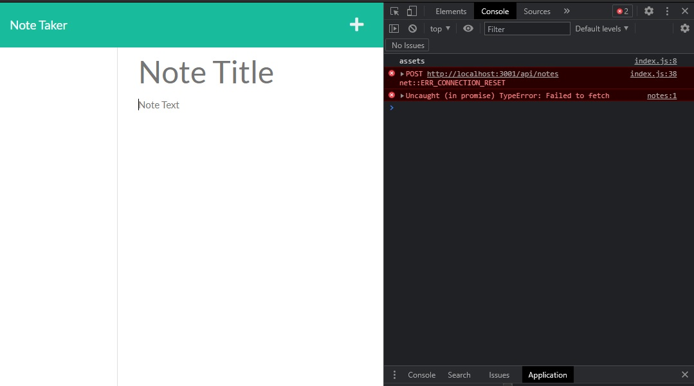

# Note Taker App 📝🙁

## Table of Contents

  1. [Description](#description)
  3. [Installation](#installation)
  4. [Usage](#usage)
  5. [Contribution](#contribution)
  6. [Testing](#testing)
  7. [Questions](#questions)
  8. [Screenshot](#screenshot)
  9. [License](#license)
  
## Description

Note Taker App can accept input from the user as a note title/body pair and stores it in a server-side file. The user is able to write, edit and delete notes using a slick, simple interface. This application has also been deployed to Heroku, although it is non-functional in its current state 🙁

## Installation

This project was built using Express.js back-end and retrieves note data written in JSON. Install node and npm to use this application from the command line if you don't already have them on your local machine.

## Usage

Use ``node .\index.js`` to launch this application. Once fully functional, it will launch a webpage that will give you the option to enter notes on a separate page, to be saved and later retrieved if desired.

## Contribution

Feel free to contribute. and please follow the [Contributor Covenant](http://contributor-covenant.org/version/1/3/0/):

* Fork the reposition
* Create a new branch (``git checkout -b improve-feature``)
* Make, add and commit the appropriate changes in the files
* Push to the branch (``git push origin improve-feature``)
* Create a Pull Request

Thanks!

## Testing

The code as-is is currently broken. I am having trouble with a connection issue and a ``TypeError: Failed to fetch`` message that I've been unable to resolve.

## Questions

Please don't hesitate to reach out to me via GitHub or email if you've got any questions! Thank you for checking out my code.

* [GitHub Profile](https://github.com/rangamboa) 

* [Email](mailto:rangamboa@gmail.com)

## Screenshot

## License

Permission is hereby granted, free of charge, to any person obtaining a copy of this software and associated documentation files (the "Software"), to deal in the Software without restriction, including without limitation the rights to use, copy, modify, merge, publish, distribute, sublicense, and/or sell copies of the Software, and to permit persons to whom the Software is furnished to do so, subject to the following conditions:

The above copyright notice and this permission notice shall be included in all copies or substantial portions of the Software.

THE SOFTWARE IS PROVIDED "AS IS", WITHOUT WARRANTY OF ANY KIND, EXPRESS OR IMPLIED, INCLUDING BUT NOT LIMITED TO THE WARRANTIES OF MERCHANTABILITY, FITNESS FOR A PARTICULAR PURPOSE AND NONINFRINGEMENT. IN NO EVENT SHALL THE AUTHORS OR COPYRIGHT HOLDERS BE LIABLE FOR ANY CLAIM, DAMAGES OR OTHER LIABILITY, WHETHER IN AN ACTION OF CONTRACT, TORT OR OTHERWISE, ARISING FROM, OUT OF OR IN CONNECTION WITH THE SOFTWARE OR THE USE OR OTHER DEALINGS IN THE SOFTWARE.

---
@2021 Ran Gamboa - ``thanks for reading!``
